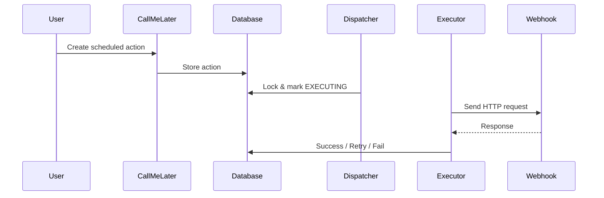
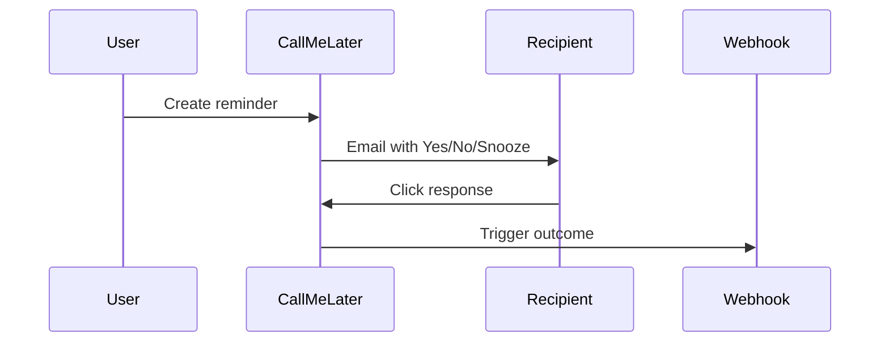

# CallMeLater — Use Cases

## Why CallMeLater?

CallMeLater is built around a simple idea: **some things should happen later — reliably — and sometimes only after a human decision**.

Instead of building cron jobs, queues, retries, approval flows, and reminder systems yourself, CallMeLater gives you a single, reliable primitive to schedule actions in the future.

This page shows concrete, real-world ways teams and developers use CallMeLater.

---

## 🔧 Developer & System Use Cases

### 1. Trial Expiration Cleanup
**Automatically clean up resources when a trial ends — unless the user upgrades.**

**Scenario**  
A user starts a 14‑day trial. If they don’t upgrade, you must revoke access and clean up data.

**How CallMeLater helps**
- Schedule a cleanup webhook at `trial_end_at`
- Cancel the action instantly if the user upgrades
- No cron jobs, no background workers to maintain

**Code example**
```bash
curl -X POST https://api.callmelater.io/v1/actions \
  -H "Authorization: Bearer API_KEY" \
  -H "Content-Type: application/json" \
  -d '{
    "execute_at": "2026-02-01T09:00:00Z",
    "callback_url": "https://example.com/cleanup",
    "payload": { "user_id": 123 }
  }'
```

---

### 2. Delayed Retries Without Cron
**Retry an operation hours or days later without keeping state.**

**Scenario**  
An external API is down. Retrying every minute is pointless.

**How CallMeLater helps**
- Schedule retries with exponential backoff
- Attempts and outcomes are fully logged
- Your app stays stateless

---

### 3. Grace Period Enforcement
**“We’ll delete this in 7 days unless…”**

**Scenario**  
Compliance rules require a grace period before deletion.

**How CallMeLater helps**
- Schedule a deletion action
- Send a reminder before execution
- Allow snooze or cancellation

---

### 4. Deferred Side Effects
**Trigger follow-up actions later — exactly once.**

Examples:
- delayed partner notifications
- post-processing jobs
- background audits

**How CallMeLater helps**
- One scheduled webhook
- Guaranteed attempts
- Idempotent execution

---

### 5. External System Follow-Ups
**Check back later when another system catches up.**

**Scenario**  
You integrate with a system that requires manual review.

**How CallMeLater helps**
- Schedule a follow-up check
- Reschedule automatically if unresolved
- No polling infrastructure required

---

## 👤 Human‑in‑the‑Loop Use Cases

### 6. “Did You Do X?” Reminders
**Lightweight accountability without task management tools.**

**Scenario**  
You need confirmation that something was done.

**How CallMeLater helps**
- Send a reminder email
- One‑click Yes / No / Snooze
- No login required for recipients

---

### 7. Approval Before Action
**Require human approval before executing risky actions.**

**Scenario**  
A destructive operation must be approved.

**How CallMeLater helps**
- Reminder is sent instead of execution
- “Yes” triggers the webhook
- “No” cancels the action

---

### 8. Escalation When No One Responds
**If nobody replies, notify someone else.**

**Scenario**  
Critical actions cannot be ignored.

**How CallMeLater helps**
- Primary reminder sent
- Automatic escalation after timeout
- Full audit trail

---

### 9. Team Confirmation Workflows
**“Everyone must confirm” vs “first response wins.”**

**Scenario**  
Safety‑critical or compliance steps.

**How CallMeLater helps**
- Multiple recipients
- Configurable confirmation mode
- Execution depends on responses

---

### 10. Manual Reminders Without Building an App
**Use CallMeLater as a simple reminder engine.**

**Scenario**  
You want reminders without building UI or mobile apps.

**How CallMeLater helps**
- Create reminders via dashboard or API
- Email-based interaction only
- No accounts required for recipients

---

## 📊 Visual Flow Diagrams

### Scheduled HTTP Action


### Human Approval Flow


---

## Final Thought

CallMeLater is not a task manager or a cron replacement.

It is a **reliable bridge between time, systems, and people** — designed to be simple, auditable, and predictable.

---

## About Animations (Healthchecks.io)

Yes — I’m familiar with the animated header on healthchecks.io.
It works well because:
- it visually explains the product in seconds
- it reinforces reliability and flow
- it stays subtle and non-distracting

You can achieve a similar effect with:
- simple SVG + CSS animations
- lightweight Lottie animations
- no heavy JS frameworks

If you want, I can help design a **CallMeLater-style header animation concept** next.
